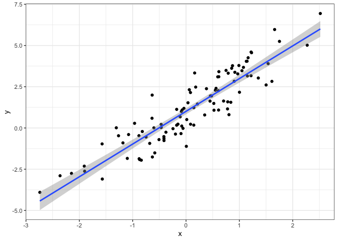

# Stan Setup


### Stan / RStan Installation

Unlike the `stan_glm()` function that we’ve recently seen, writing stan
code from scratch requires a C compiler. (The `stan_glm()` functions are
pre-compiled).

Thus we need to follow steps to update the compiler before stan will
work. First try the following code and if you are lucky you won’t need
to do any additional installations.

``` r
library(rstan)
```

    Loading required package: StanHeaders


    rstan version 2.32.6 (Stan version 2.32.2)

    For execution on a local, multicore CPU with excess RAM we recommend calling
    options(mc.cores = parallel::detectCores()).
    To avoid recompilation of unchanged Stan programs, we recommend calling
    rstan_options(auto_write = TRUE)
    For within-chain threading using `reduce_sum()` or `map_rect()` Stan functions,
    change `threads_per_chain` option:
    rstan_options(threads_per_chain = 1)

``` r
example(stan_model, package = "rstan", run.dontrun = TRUE)
```

    Trying to compile a simple C file

If not, [Start Here](https://mc-stan.org/rstan/) for guidance on how to
install everything necessary to run stan code.

------------------------------------------------------------------------

The [https://mc-stan.org/docs/stan-users-guide/](Stan%20user%20guide)
has nice examples and will be a helpful resource moving forward.

------------------------------------------------------------------------

### Simulate data

To show how Stan can be combine with R data, consider the simple linear
regression example with simulated data.

``` r
library(tidyverse)
```

    ── Attaching core tidyverse packages ──────────────────────── tidyverse 2.0.0 ──
    ✔ dplyr     1.1.4     ✔ readr     2.1.5
    ✔ forcats   1.0.0     ✔ stringr   1.5.1
    ✔ ggplot2   3.5.1     ✔ tibble    3.2.1
    ✔ lubridate 1.9.3     ✔ tidyr     1.3.1
    ✔ purrr     1.0.2     
    ── Conflicts ────────────────────────────────────────── tidyverse_conflicts() ──
    ✖ tidyr::extract() masks rstan::extract()
    ✖ dplyr::filter()  masks stats::filter()
    ✖ dplyr::lag()     masks stats::lag()
    ℹ Use the conflicted package (<http://conflicted.r-lib.org/>) to force all conflicts to become errors

``` r
n <- 100
beta <- matrix(c(1,2), nrow = 2, ncol = 1)
beta <- c(1,2)

X <- cbind(rep(1,n), rnorm(n))
sigma <- 1

y <- rnorm(n, X%*%beta, sigma)

tibble(x = X[,2], y = y) |>
  ggplot(aes(x =x, y =y)) +
  geom_point() +
  geom_smooth(formula = 'y~x', method = 'lm') +
  theme_bw()
```



    data {
      int<lower=0> N;
      vector[N] x;
      vector[N] y;
    }
    parameters {
      real beta0;
      real beta;
      real<lower=0> sigma;
    }
    model {
      y ~ normal(beta0 + beta * x, sigma);
    }

``` r
fit <- stan(file = 'regression.stan', 
            data = list(y = y, x = X[,2], N = n))
```

    Trying to compile a simple C file

``` r
print(fit)
```

    Inference for Stan model: anon_model.
    4 chains, each with iter=2000; warmup=1000; thin=1; 
    post-warmup draws per chain=1000, total post-warmup draws=4000.

            mean se_mean   sd   2.5%    25%    50%    75%  97.5% n_eff Rhat
    beta0   1.01    0.00 0.09   0.82   0.95   1.01   1.07   1.19  3487    1
    beta    1.98    0.00 0.09   1.81   1.92   1.98   2.05   2.16  3468    1
    sigma   0.92    0.00 0.07   0.80   0.88   0.92   0.97   1.07  3484    1
    lp__  -41.37    0.03 1.23 -44.60 -41.93 -41.07 -40.47 -39.95  1905    1

    Samples were drawn using NUTS(diag_e) at Thu Feb 27 15:22:28 2025.
    For each parameter, n_eff is a crude measure of effective sample size,
    and Rhat is the potential scale reduction factor on split chains (at 
    convergence, Rhat=1).
